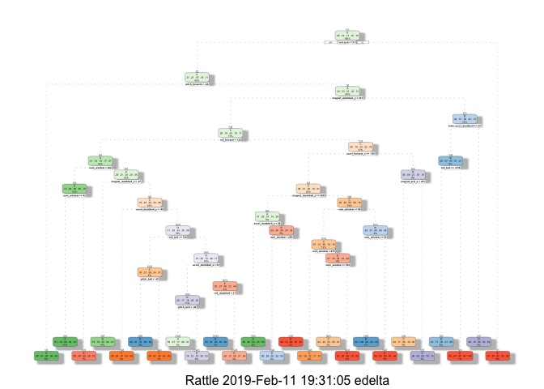

Introduction
============

Context
-------

Research on activity recognition has traditionally focused on
discriminating between different activities, i.e. to predict *“which”*
activity was performed at a specific point in time. The quality of
executing an activity, the *“how (well)”*, has only received little
attention so far, even though it potentially provides useful information
for a large variety of applications. In this work we define quality of
execution and investigate three aspects that pertain to qualitative
activity recognition: specifying correct execution, detecting execution
mistakes, providing feedback on the to the user.

In this project, your goal will be to use data from accelerometers on
the belt, forearm, arm, and dumbell of 6 participants. They were asked
to perform barbell lifts correctly and incorrectly in 5 different ways.
More information is available from the website here:
[http://groupware.les.inf.puc-rio.br/har](http://web.archive.org/web/20161224072740/http:/groupware.les.inf.puc-rio.br/har)
(see the section on the Weight Lifting Exercise Dataset).

The data for this project come from this study:
[http://groupware.les.inf.puc-rio.br/har](http://web.archive.org/web/20161224072740/http:/groupware.les.inf.puc-rio.br/har).
If you use the document you create for this class for any purpose please
cite them as they have been very generous in allowing their data to be
used for this kind of assignment.

The following links provides the [informations about the
authors](http://groupware.les.inf.puc-rio.br/work.jsf?p1=11201) and
[Documentation](http://groupware.les.inf.puc-rio.br/public/papers/2013.Velloso.QAR-WLE.pdf)
about the original study.

Data
----

The training data for this project are available here:

<https://d396qusza40orc.cloudfront.net/predmachlearn/pml-training.csv>

The test data are available here:

<https://d396qusza40orc.cloudfront.net/predmachlearn/pml-testing.csv>

The participants were asked to perform one set of 10 repetitions of the
Unilateral Dumbbell Biceps Curl in five different fashions: exactly
according to the specification (**Class A**), throwing the elbows to the
front (**Class B**), lifting the dumbbell only halfway (**Class C**),
lowering the dumbbell only halfway (**Class D**) and throwing the hips
to the front (**Class E**). **Class A** corresponds to the specified
execution of the exercise, while the other 4 classes correspond to
common mistakes, [Read
more](http://groupware.les.inf.puc-rio.br/har#ixzz5f70D9k00).

Exploratory data analysis
=========================

    load_data <- function(file_url, data_dir = 'data'){
        if(!dir.exists(data_dir)) dir.create(data_dir)
        file_path <- file.path(data_dir, basename(file_url))
        if(!file.exists(file_path)) download.file(file_url, file_path, quiet = TRUE)
        if(!file.exists(file_path)) stop('Unable to download file ', file_url)
        # clean the dummy values like '', 'NA', '#DIV/0!'
        read.csv(file_path, na.strings = c('', 'NA', '#DIV/0!'))
        # NOTE : if new / transformed columns are needed
        # transform(
        #     read.csv(file_path, na.strings = c('', 'NA', '#DIV/0!')),
        #     raw_timestamp = as.POSIXct(as.integer(as.numeric(as.character(raw_timestamp_part_1))), origin = '1970-01-01', tz = 'GMT'),
        #     cvtd_timestamp = strptime(cvtd_timestamp, format = '%d/%m/%Y %H:%M')
        # )
    }

    pml_training <- load_data('https://d396qusza40orc.cloudfront.net/predmachlearn/pml-training.csv')
    dim(pml_training)

    ## [1] 19622   160

A quick look at the data highlight few points.

    set.seed(9999)

    # hist(as.numeric(pml_training$classe), main = 'Histogram of classes', xlab = 'classe')
    # aggregate(training$classe, list(classe = training$classe), length)
    table(pml_training$classe)

    ## 
    ##    A    B    C    D    E 
    ## 5580 3797 3422 3216 3607

The testing data doesn't contains a `classe` variable to be compared
with. The `classe` elements seems pretty well balanced across the
training data set although class `A` is over represented. Note that
class `A` corresponds to the specified execution of the exercise, while
the other 4 classes correspond to common mistakes.

Many missing values
-------------------

    # sapply(pml_training[, sapply(pml_training, function(x) sum(is.na(x)) < nrow(pml_training) * 0.95)], function(x) sum(is.na(x)))
    high_na <- sapply(pml_training, function(x) sum(is.na(x)) / nrow(pml_training))
    highest_na <- high_na[high_na >= 0.05]

An exploratory of the variables values shows that many variables
contains a high ratio of missing values. 62.5% of the variables filtered
on a *r**a**t**e* &gt; 0.05 contains at least 97.93% of `NA`s values.

This rate is too high to impute data in the training data set with
confidence.

Build tidy datas set
--------------------

    names(pml_training[, grep('num_window|belt|forearm|arm|dumbbell|classe', names(pml_training), invert = TRUE)])

    ## [1] "X"                    "user_name"            "raw_timestamp_part_1"
    ## [4] "raw_timestamp_part_2" "cvtd_timestamp"       "new_window"

    library(caret)

    ## Loading required package: lattice

    ## Loading required package: ggplot2

    tidy_data <- function(raw_data, treshold = 0.95){
        # NOTE : select predictors minus variables where the value is nearly the same
        tidy_predictor <- raw_data[, setdiff(grep('num_window|belt|forearm|arm|dumbbell|classe', names(raw_data)), nearZeroVar(raw_data))]
        # NOTE : keep column if NA ratio < 0.95
        ceil <- nrow(tidy_predictor) * treshold
        tidy_predictor[, sapply(tidy_predictor, function(x) sum(is.na(x)) < ceil)]
    }

    tidy_training  <- tidy_data(pml_training)
    classe_col <- which(colnames(tidy_training) == 'classe')
    dim(tidy_training)

    ## [1] 19622    54

The predictors have been selected because of the naming related to the
sensor types, plus the num\_windows which after some digging help to
group the records.

As this is a classification prediction problem, I decided to try 2
appoaches : 1. Random Forest 2. Regression Trees

The training dataset have been splited in half, one part for each
training type. Then each subset is separated between a training data set
and a validation dataset.

    inBuild <- createFolds(y = tidy_training$classe, k = 2)
    buildRf <- tidy_training[inBuild[[1]], ]
    buildRpart <- tidy_training[-inBuild[[2]], ]

    inTrainRf <- createDataPartition(y = buildRf$classe, p = 0.7, list = F)
    trainingRf <- buildRf[inTrainRf, ]
    validationRf <- buildRf[-inTrainRf, ]

    inTrainRpart <- createDataPartition(y = buildRpart$classe, p = 0.7, list = F)
    trainingRpart <- buildRpart[inTrainRpart, ]
    validationRpart <- buildRpart[-inTrainRpart, ]
    rm(inBuild, buildRf, inTrainRf, buildRpart, inTrainRpart)

    dim(trainingRf)

    ## [1] 6869   54

    dim(validationRf)

    ## [1] 2942   54

    dim(trainingRpart)

    ## [1] 6869   54

    dim(validationRpart)

    ## [1] 2942   54

Analysis
========

Random Forest
-------------

I'll first start with the random forest as it usually provides more
accurate predictions with a cost of more computation power.

    library(ggplot2)
    library(randomForest)

    ## randomForest 4.6-14

    ## Type rfNews() to see new features/changes/bug fixes.

    ## 
    ## Attaching package: 'randomForest'

    ## The following object is masked from 'package:ggplot2':
    ## 
    ##     margin

    modRf <- train(classe ~ ., data = trainingRf, method = 'rf', prox = T)
    modRf

    ## Random Forest 
    ## 
    ## 6869 samples
    ##   53 predictor
    ##    5 classes: 'A', 'B', 'C', 'D', 'E' 
    ## 
    ## No pre-processing
    ## Resampling: Bootstrapped (25 reps) 
    ## Summary of sample sizes: 6869, 6869, 6869, 6869, 6869, 6869, ... 
    ## Resampling results across tuning parameters:
    ## 
    ##   mtry  Accuracy   Kappa    
    ##    2    0.9782907  0.9725304
    ##   27    0.9858866  0.9821421
    ##   53    0.9790162  0.9734498
    ## 
    ## Accuracy was used to select the optimal model using the largest value.
    ## The final value used for the model was mtry = 27.

    varImp(modRf)

    ## rf variable importance
    ## 
    ##   only 20 most important variables shown (out of 53)
    ## 
    ##                      Overall
    ## num_window           100.000
    ## roll_belt             73.089
    ## pitch_forearm         47.791
    ## magnet_dumbbell_y     36.091
    ## yaw_belt              36.033
    ## magnet_dumbbell_z     35.836
    ## pitch_belt            31.522
    ## roll_forearm          27.606
    ## accel_dumbbell_y      14.920
    ## roll_dumbbell         13.141
    ## accel_forearm_x       12.834
    ## total_accel_dumbbell  11.778
    ## magnet_dumbbell_x     11.533
    ## magnet_belt_y         11.220
    ## accel_dumbbell_z      10.483
    ## accel_belt_z           9.716
    ## magnet_belt_z          8.704
    ## magnet_forearm_z       8.493
    ## yaw_dumbbell           6.844
    ## magnet_belt_x          6.593

    predRf <- predict(modRf, validationRf)
    cmRf <- confusionMatrix(predRf, validationRf$classe)
    cmRf

    ## Confusion Matrix and Statistics
    ## 
    ##           Reference
    ## Prediction   A   B   C   D   E
    ##          A 836   8   0   0   0
    ##          B   1 560   5   0   0
    ##          C   0   0 506   2   0
    ##          D   0   1   2 480   2
    ##          E   0   0   0   0 539
    ## 
    ## Overall Statistics
    ##                                           
    ##                Accuracy : 0.9929          
    ##                  95% CI : (0.9891, 0.9956)
    ##     No Information Rate : 0.2845          
    ##     P-Value [Acc > NIR] : < 2.2e-16       
    ##                                           
    ##                   Kappa : 0.991           
    ##  Mcnemar's Test P-Value : NA              
    ## 
    ## Statistics by Class:
    ## 
    ##                      Class: A Class: B Class: C Class: D Class: E
    ## Sensitivity            0.9988   0.9842   0.9864   0.9959   0.9963
    ## Specificity            0.9962   0.9975   0.9992   0.9980   1.0000
    ## Pos Pred Value         0.9905   0.9894   0.9961   0.9897   1.0000
    ## Neg Pred Value         0.9995   0.9962   0.9971   0.9992   0.9992
    ## Prevalence             0.2845   0.1934   0.1744   0.1638   0.1839
    ## Detection Rate         0.2842   0.1903   0.1720   0.1632   0.1832
    ## Detection Prevalence   0.2869   0.1924   0.1727   0.1649   0.1832
    ## Balanced Accuracy      0.9975   0.9908   0.9928   0.9969   0.9982

As expected the Random forest prediction accuracy (0.99286) is very
high, which makes the outcome quite reliable.

Decision tree
-------------

The second prediction model used to predict the classes is a Regression
tree. It worth noting that the default setting for the `caret` package
is quite weak with this data set. The `rpart` function default
parameters provide a better prediction. This prediction can be reach by
tweaking the caret params though.

    library(rpart)
    # NOTE : this result can also be obtain using
    # modRpart <- rpart(classe ~ ., data = trainingRpart, method = 'class')
    # predRpart <- predict(modRpart, validationRpart, type = 'class')
    # Here to get more accute outcome trainControl need to be disabled and cp set to 0.01
    # It's a case where caret default optimisation are actually performing worst than rpart basic setup
    modRpart <- train(classe ~ ., method = 'rpart', data = trainingRpart, trControl = trainControl(method = 'none'), tuneGrid = data.frame(cp = 0.01))
    modRpart

    ## CART 
    ## 
    ## 6869 samples
    ##   53 predictor
    ##    5 classes: 'A', 'B', 'C', 'D', 'E' 
    ## 
    ## No pre-processing
    ## Resampling: None

    predRpart <- predict(modRpart, validationRpart)
    cmRpart <- confusionMatrix(predRpart, validationRpart$classe)
    cmRpart

    ## Confusion Matrix and Statistics
    ## 
    ##           Reference
    ## Prediction   A   B   C   D   E
    ##          A 764 134  18  33  12
    ##          B  12 309  20  30  21
    ##          C   6  63 395  66  13
    ##          D  49  51  80 314  34
    ##          E   6  12   0  39 461
    ## 
    ## Overall Statistics
    ##                                           
    ##                Accuracy : 0.7624          
    ##                  95% CI : (0.7466, 0.7777)
    ##     No Information Rate : 0.2845          
    ##     P-Value [Acc > NIR] : < 2.2e-16       
    ##                                           
    ##                   Kappa : 0.6982          
    ##  Mcnemar's Test P-Value : < 2.2e-16       
    ## 
    ## Statistics by Class:
    ## 
    ##                      Class: A Class: B Class: C Class: D Class: E
    ## Sensitivity            0.9128   0.5431   0.7700   0.6515   0.8521
    ## Specificity            0.9064   0.9650   0.9391   0.9130   0.9763
    ## Pos Pred Value         0.7950   0.7883   0.7274   0.5947   0.8900
    ## Neg Pred Value         0.9631   0.8980   0.9508   0.9304   0.9670
    ## Prevalence             0.2845   0.1934   0.1744   0.1638   0.1839
    ## Detection Rate         0.2597   0.1050   0.1343   0.1067   0.1567
    ## Detection Prevalence   0.3266   0.1332   0.1846   0.1795   0.1761
    ## Balanced Accuracy      0.9096   0.7540   0.8545   0.7822   0.9142

The Decision tree prediction accuracy (0.76241) is much weaker than the
Random forest prediction, even if it performs above the average.

    ## Rattle: A free graphical interface for data science with R.
    ## Version 5.2.0 Copyright (c) 2006-2018 Togaware Pty Ltd.
    ## Type 'rattle()' to shake, rattle, and roll your data.

    ## 
    ## Attaching package: 'rattle'

    ## The following object is masked from 'package:randomForest':
    ## 
    ##     importance

Test cases predictions
======================

The trained machine learning algorithm generated above are now used to
predict 20 test cases.

    pml_testing <- load_data('https://d396qusza40orc.cloudfront.net/predmachlearn/pml-testing.csv')
    dim(pml_testing)

    ## [1]  20 160

    # variables in training not present in testing
    setdiff(names(pml_training), names(pml_testing))

    ## [1] "classe"

    # variables in testing not present in training
    setdiff(names(pml_testing), names(pml_training))

    ## [1] "problem_id"

    testing <- tidy_data(pml_testing)
    testing <- testing[, intersect(names(testing), names(tidy_training))]
    dim(testing)

    ## [1] 20 53

    testingRf <- predict(modRf, testing)
    testingRf

    ##  [1] B A B A A E D B A A B C B A E E A B B B
    ## Levels: A B C D E

    testingRpartPred <- predict(modRpart$finalModel, testing)
    testingRpart <- colnames(testingRpartPred)[apply(testingRpartPred, 1, function(x) which.max(x))]
    levels(testingRpart) <- colnames(testingRpartPred)
    testingRpart

    ##  [1] "C" "A" "C" "A" "A" "E" "D" "D" "A" "A" "C" "C" "B" "A" "E" "E" "A"
    ## [18] "A" "A" "B"
    ## attr(,"levels")
    ## [1] "A" "B" "C" "D" "E"

    table(testingRpart, testingRf)

    ##             testingRf
    ## testingRpart A B C D E
    ##            A 7 2 0 0 0
    ##            B 0 2 0 0 0
    ##            C 0 3 1 0 0
    ##            D 0 1 0 1 0
    ##            E 0 0 0 0 3

There is a 70% of prediction matching between the 2 models.

Conclusion
==========

The Random Forest prediction model is a clear winner to predict the
excercice `classe` out of the available predictors.

The Random forest prediction is very sensitive to the settings
parameters used to train the algorithm. It produce a decent prediction
though, but not good enough to par with the Random forest predictions.
