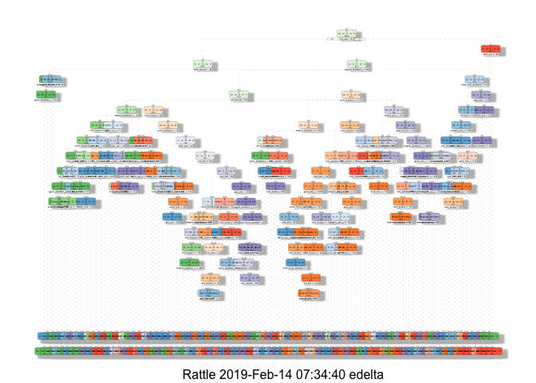

Introduction
============

Context
-------

Research on activity recognition has traditionally focused on discriminating between different activities, i.e. to predict *“which”* activity was performed at a specific point in time. The quality of executing an activity, the *“how (well)”*, has only received little attention so far, even though it potentially provides useful information for a large variety of applications. In this work we define quality of execution and investigate three aspects that pertain to qualitative activity recognition: specifying correct execution, detecting execution mistakes, providing feedback on the to the user.

In this project, your goal will be to use data from accelerometers on the belt, forearm, arm, and dumbell of 6 participants. They were asked to perform barbell lifts correctly and incorrectly in 5 different ways. More information is available from the website here: [http://groupware.les.inf.puc-rio.br/har](http://web.archive.org/web/20161224072740/http:/groupware.les.inf.puc-rio.br/har) (see the section on the Weight Lifting Exercise Dataset).

The data for this project come from this study: [http://groupware.les.inf.puc-rio.br/har](http://web.archive.org/web/20161224072740/http:/groupware.les.inf.puc-rio.br/har). If you use the document you create for this class for any purpose please cite them as they have been very generous in allowing their data to be used for this kind of assignment.

The following links provides the [informations about the authors](http://groupware.les.inf.puc-rio.br/work.jsf?p1=11201) and [Documentation](http://groupware.les.inf.puc-rio.br/public/papers/2013.Velloso.QAR-WLE.pdf) about the original study.

Data
----

The training data for this project are available here:

<https://d396qusza40orc.cloudfront.net/predmachlearn/pml-training.csv>

The test data are available here:

<https://d396qusza40orc.cloudfront.net/predmachlearn/pml-testing.csv>

The participants were asked to perform one set of 10 repetitions of the Unilateral Dumbbell Biceps Curl in five different fashions: exactly according to the specification (**Class A**), throwing the elbows to the front (**Class B**), lifting the dumbbell only halfway (**Class C**), lowering the dumbbell only halfway (**Class D**) and throwing the hips to the front (**Class E**). **Class A** corresponds to the specified execution of the exercise, while the other 4 classes correspond to common mistakes, [Read more](http://groupware.les.inf.puc-rio.br/har#ixzz5f70D9k00).

Exploratory data analysis
=========================

``` r
load_data <- function(file_url, data_dir = 'data', cache = FALSE){
    # load the data model from the url
    file_path <- url(file_url)
    if(cache){
        if(!dir.exists(data_dir)) dir.create(data_dir)
        file_path <- file.path(data_dir, basename(file_url))
        if(!file.exists(file_path)) download.file(file_url, file_path, quiet = TRUE)
        if(!file.exists(file_path)) stop('Unable to download file ', file_url)
    }
    # clean the dummy values like '', 'NA', '#DIV/0!'
    read.csv(file_path, na.strings = c('', 'NA', '#DIV/0!'))
    # NOTE : if new / transformed columns are needed
    # transform(
    #     read.csv(file_path, na.strings = c('', 'NA', '#DIV/0!')),
    #     raw_timestamp = as.POSIXct(as.integer(as.numeric(as.character(raw_timestamp_part_1))), origin = '1970-01-01', tz = 'GMT'),
    #     cvtd_timestamp = strptime(cvtd_timestamp, format = '%d/%m/%Y %H:%M')
    # )
}

pml_training <- load_data('https://d396qusza40orc.cloudfront.net/predmachlearn/pml-training.csv')
dim(pml_training)
```

    ## [1] 19622   160

A quick look at the data highlight few points.

``` r
set.seed(9999)

# hist(as.numeric(pml_training$classe), main = 'Histogram of classes', xlab = 'classe')
# aggregate(training$classe, list(classe = training$classe), length)
table(pml_training$classe)
```

    ## 
    ##    A    B    C    D    E 
    ## 5580 3797 3422 3216 3607

The testing data doesn't contains a `classe` variable to be compared with. The `classe` elements seems pretty well balanced across the training data set although class `A` is over represented. Note that class `A` corresponds to the specified execution of the exercise, while the other 4 classes correspond to common mistakes.

Many missing values
-------------------

``` r
# sapply(pml_training[, sapply(pml_training, function(x) sum(is.na(x)) < nrow(pml_training) * 0.95)], function(x) sum(is.na(x)))
high_na <- colSums(is.na(pml_training)) / nrow(pml_training)
# high_na <- sapply(pml_training, function(x) sum(is.na(x)) / nrow(pml_training))
highest_na <- high_na[high_na >= 0.05]
```

An exploratory of the variables values shows that many variables contains a high ratio of missing values. 62.5% of the variables filtered on a *r**a**t**e* &gt; 0.05 contains at least 97.93% of `NA`s values.

This rate is too high to impute data in the training data set with confidence.

Build tidy datas set
--------------------

``` r
names(pml_training[, grep('num_window|belt|forearm|arm|dumbbell|classe', names(pml_training), invert = TRUE)])
```

    ## [1] "X"                    "user_name"            "raw_timestamp_part_1"
    ## [4] "raw_timestamp_part_2" "cvtd_timestamp"       "new_window"

``` r
# library(caret)
tidy_data <- function(raw_data, treshold = 0.95){
    # NOTE : select predictors minus variables where the value is nearly the same
    tidy_predictor <- raw_data[, setdiff(grep('num_window|belt|forearm|arm|dumbbell|classe', names(raw_data)), nearZeroVar(raw_data))]
    # NOTE : keep column if NA ratio < 0.95
    ceil <- nrow(tidy_predictor) * treshold
    # tidy_predictor[, sapply(tidy_predictor, function(x) sum(is.na(x)) < ceil)]
    tidy_predictor[, colSums(is.na(tidy_predictor)) < ceil]
}

tidy_training  <- tidy_data(pml_training)
classe_col <- which(colnames(tidy_training) == 'classe')
dim(tidy_training)
```

    ## [1] 19622    54

The predictors have been selected because of the naming related to the sensor types, plus the num\_windows which after some digging help to group the records.

As this is a classification prediction problem, I decided to try 2 appoaches : 1. Random Forest 2. Regression Trees

The training dataset have been splited in half, one part for each training type. Then each subset is separated between a training data set and a validation dataset.

``` r
inBuild <- createFolds(y = tidy_training$classe, k = 2)
training <- tidy_training[inBuild[[1]], ]
validation <- tidy_training[-inBuild[[2]], ]

dim(training)
```

    ## [1] 9811   54

``` r
dim(validation)
```

    ## [1] 9811   54

Analysis
========

Multinomial Logistic Regression
-------------------------------

The 1st way to calculate an estimate will be using a statistical method. The most common to predict unordered categorical variable is the Multinomial logistic regression.

In statistics, multinomial logistic regression is a classification method that generalizes logistic regression to multiclass problems, i.e. with more than two possible discrete outcomes. That is, it is a model that is used to predict the probabilities of the different possible outcomes of a categorically distributed dependent variable, given a set of independent variables (which may be real-valued, binary-valued, categorical-valued, etc.).

``` r
modMlr <- multinom(classe ~ ., data = training)
```

    ## # weights:  275 (216 variable)
    ## initial  value 15790.195359 
    ## iter  10 value 12600.332414
    ## iter  20 value 11614.084962
    ## iter  30 value 10727.218299
    ## iter  40 value 10236.235817
    ## iter  50 value 9859.859501
    ## iter  60 value 9584.129244
    ## iter  70 value 9397.129607
    ## iter  80 value 9271.572106
    ## iter  90 value 9220.628552
    ## iter 100 value 9171.491499
    ## final  value 9171.491499 
    ## stopped after 100 iterations

``` r
modMlr
```

    ## Call:
    ## multinom(formula = classe ~ ., data = training)
    ## 
    ## Coefficients:
    ##     (Intercept)   num_window   roll_belt  pitch_belt    yaw_belt
    ## B -0.0005058952 2.642206e-03  0.05128322 -0.17176303 -0.08729704
    ## C -0.0005882219 1.988102e-04  0.04733392 -0.06140214 -0.08115502
    ## D  0.0022713992 1.454622e-03 -0.10100506 -0.02621568 -0.05277472
    ## E  0.0017884679 7.985195e-05  0.11753268  0.09587673 -0.05372467
    ##   total_accel_belt  gyros_belt_x  gyros_belt_y gyros_belt_z accel_belt_x
    ## B      -0.17730971  0.0037450378 -0.0007687598  0.005523643  0.077646850
    ## C      -0.10923339  0.0002048844 -0.0009763632 -0.008452617  0.043312291
    ## D       0.21683211 -0.0012280968  0.0031064164  0.007988711  0.001151624
    ## E       0.07811579  0.0049352672 -0.0008160093  0.010577800  0.003002824
    ##   accel_belt_y accel_belt_z magnet_belt_x magnet_belt_y magnet_belt_z
    ## B   0.04598295  -0.05021818  -0.046693950  0.0090193977    0.02459713
    ## C   0.07242033  -0.04372924  -0.032445030 -0.0004111769    0.03050816
    ## D  -0.00734898  -0.08774831  -0.008673921 -0.0003589127    0.01465140
    ## E  -0.07800728  -0.02344488  -0.004253125 -0.0164741318    0.01542557
    ##       roll_arm     pitch_arm      yaw_arm total_accel_arm gyros_arm_x
    ## B  0.001014164  8.105252e-05 0.0055659600     -0.05089258  0.06564083
    ## C  0.003459567 -4.870963e-03 0.0037846425     -0.01188558 -0.01384513
    ## D -0.002648038 -5.907409e-03 0.0030211415      0.02905457  0.02742970
    ## E  0.001304121 -4.744351e-03 0.0009385919      0.00951192  0.10295796
    ##   gyros_arm_y  gyros_arm_z  accel_arm_x  accel_arm_y accel_arm_z
    ## B -0.03577123 -0.003129190 -0.020803942  0.003468440  0.01377931
    ## C  0.01571100  0.012964141 -0.010987970 -0.009813868  0.01132310
    ## D -0.01671247  0.002256148 -0.001500622 -0.014779805  0.01938787
    ## E -0.02389907  0.003812199 -0.009970833  0.001429670  0.02155244
    ##    magnet_arm_x  magnet_arm_y magnet_arm_z roll_dumbbell pitch_dumbbell
    ## B  0.0030126858 -0.0017087660 -0.012109247   0.007542552    -0.01429073
    ## C  0.0028704067  0.0021066225 -0.003916641   0.007330030    -0.02363873
    ## D -0.0003221113  0.0003505125 -0.005133468   0.016131421    -0.01023854
    ## E  0.0002675380 -0.0071999429 -0.006879599   0.016653795    -0.01709087
    ##   yaw_dumbbell total_accel_dumbbell gyros_dumbbell_x gyros_dumbbell_y
    ## B -0.007517594           0.12729810      0.006456524     -0.032679022
    ## C -0.012296376          -0.01843987     -0.003046061      0.047467577
    ## D -0.019820282           0.05131511      0.025910031      0.002295634
    ## E -0.014130666           0.22747496      0.001580790      0.004245186
    ##   gyros_dumbbell_z accel_dumbbell_x accel_dumbbell_y accel_dumbbell_z
    ## B     -0.011423110       0.02087365      0.006267726      0.003703393
    ## C      0.007095755       0.04148171     -0.004136516     -0.024375907
    ## D     -0.007998835       0.01428517      0.001039885      0.004776324
    ## E     -0.018177937       0.04221649     -0.004458407      0.002611425
    ##   magnet_dumbbell_x magnet_dumbbell_y magnet_dumbbell_z  roll_forearm
    ## B      -0.003726779      -0.006769628       0.001965123  0.0027167519
    ## C      -0.005420479      -0.006146807       0.041379435  0.0015707340
    ## D      -0.007080930      -0.006347076       0.024779418 -0.0002250588
    ## E      -0.014021657      -0.006906258       0.028091066  0.0021923243
    ##   pitch_forearm   yaw_forearm total_accel_forearm gyros_forearm_x
    ## B   0.009542644 -0.0003369405          0.03903049     0.023770396
    ## C   0.015406631 -0.0008284536          0.04053055     0.011373500
    ## D   0.023533137 -0.0024355857          0.03286404    -0.004790359
    ## E   0.018123805  0.0003028422          0.08362147    -0.024992479
    ##   gyros_forearm_y gyros_forearm_z accel_forearm_x accel_forearm_y
    ## B   -0.0171292029    -0.002302220     0.010056001    0.0009106093
    ## C   -0.0004551484    -0.001255191     0.001842199    0.0001555424
    ## D    0.0021865871    -0.009689712    -0.006508578    0.0018977032
    ## E    0.0165393833     0.001086077     0.011527073    0.0025607050
    ##   accel_forearm_z magnet_forearm_x magnet_forearm_y magnet_forearm_z
    ## B     0.004334818    -0.0026385246    -1.023535e-03    -0.0033094970
    ## C    -0.015906707    -0.0004750519     4.570687e-05     0.0013118524
    ## D    -0.010635244     0.0025818270     6.405382e-04     0.0005895437
    ## E    -0.018291947    -0.0044625061    -2.553271e-03    -0.0011533922
    ## 
    ## Residual Deviance: 18342.98 
    ## AIC: 18774.98

``` r
predMlr <- predict(modMlr, validation)
cmMlr <- confusionMatrix(predMlr, validation$classe)
cmMlr
```

    ## Confusion Matrix and Statistics
    ## 
    ##           Reference
    ## Prediction    A    B    C    D    E
    ##          A 2238  281  149  144  154
    ##          B  172 1010  164   71  180
    ##          C  145  260  998  216  184
    ##          D  121  102  195 1081  189
    ##          E  114  245  205   96 1097
    ## 
    ## Overall Statistics
    ##                                           
    ##                Accuracy : 0.6548          
    ##                  95% CI : (0.6453, 0.6642)
    ##     No Information Rate : 0.2844          
    ##     P-Value [Acc > NIR] : < 2.2e-16       
    ##                                           
    ##                   Kappa : 0.5627          
    ##  Mcnemar's Test P-Value : < 2.2e-16       
    ## 
    ## Statistics by Class:
    ## 
    ##                      Class: A Class: B Class: C Class: D Class: E
    ## Sensitivity            0.8022   0.5321   0.5833   0.6723   0.6081
    ## Specificity            0.8963   0.9258   0.9006   0.9260   0.9176
    ## Pos Pred Value         0.7546   0.6324   0.5535   0.6404   0.6244
    ## Neg Pred Value         0.9194   0.8919   0.9110   0.9351   0.9122
    ## Prevalence             0.2844   0.1935   0.1744   0.1639   0.1839
    ## Detection Rate         0.2281   0.1029   0.1017   0.1102   0.1118
    ## Detection Prevalence   0.3023   0.1628   0.1838   0.1721   0.1791
    ## Balanced Accuracy      0.8492   0.7290   0.7420   0.7991   0.7628

The Multinomial Logistic Regression prediction accuracy (0.65478) is above the average which is good, but isn't very reliable.

Random Forest
-------------

I'll first start with the random forest as it usually provides more accurate predictions with a cost of more computation power.

Random forests or random decision forests are an ensemble learning method for classification, regression and other tasks that operates by constructing a multitude of decision trees at training time and outputting the class that is the mode of the classes (classification) or mean prediction (regression) of the individual trees. Random decision forests correct for decision trees' habit of overfitting to their training set.

``` r
# library(ggplot2)
# library(randomForest)
# library(beepr)
modRf <- train(classe ~ ., data = training, method = 'rf', prox = TRUE, trControl = trainControl(method = 'cv', number = 10, allowParallel = TRUE, verboseIter = FALSE))
# No k-mean cross validation, Bootstrap resampling method 1 resampling iteration
# Optimal setting, but overkill in the present case
# modRf <- train(classe ~ ., data = training, method = 'rf', prox = TRUE, trControl = trainControl(method = 'boot', number = 1, allowParallel = TRUE))
# beep()
modRf
```

    ## Random Forest 
    ## 
    ## 9811 samples
    ##   53 predictor
    ##    5 classes: 'A', 'B', 'C', 'D', 'E' 
    ## 
    ## No pre-processing
    ## Resampling: Cross-Validated (10 fold) 
    ## Summary of sample sizes: 8830, 8829, 8830, 8830, 8831, 8831, ... 
    ## Resampling results across tuning parameters:
    ## 
    ##   mtry  Accuracy   Kappa    
    ##    2    0.9909288  0.9885237
    ##   27    0.9953122  0.9940700
    ##   53    0.9921528  0.9900727
    ## 
    ## Accuracy was used to select the optimal model using the largest value.
    ## The final value used for the model was mtry = 27.

``` r
# modRf$resample
varImp(modRf)
```

    ## rf variable importance
    ## 
    ##   only 20 most important variables shown (out of 53)
    ## 
    ##                      Overall
    ## num_window           100.000
    ## roll_belt             68.110
    ## pitch_forearm         42.070
    ## yaw_belt              35.149
    ## magnet_dumbbell_z     32.220
    ## magnet_dumbbell_y     31.771
    ## pitch_belt            29.770
    ## roll_forearm          24.230
    ## accel_dumbbell_y      13.385
    ## accel_forearm_x       11.746
    ## roll_dumbbell         11.662
    ## magnet_dumbbell_x     11.418
    ## total_accel_dumbbell   9.745
    ## accel_belt_z           9.619
    ## accel_dumbbell_z       9.008
    ## magnet_belt_y          8.932
    ## magnet_belt_z          8.289
    ## magnet_forearm_z       6.778
    ## magnet_belt_x          5.953
    ## yaw_dumbbell           5.624

``` r
confusionMatrix.train(modRf)
```

    ## Cross-Validated (10 fold) Confusion Matrix 
    ## 
    ## (entries are percentual average cell counts across resamples)
    ##  
    ##           Reference
    ## Prediction    A    B    C    D    E
    ##          A 28.4  0.1  0.0  0.0  0.0
    ##          B  0.0 19.2  0.1  0.0  0.0
    ##          C  0.0  0.0 17.3  0.1  0.0
    ##          D  0.0  0.0  0.0 16.2  0.1
    ##          E  0.0  0.0  0.0  0.0 18.3
    ##                             
    ##  Accuracy (average) : 0.9953

``` r
predRf <- predict(modRf, validation)
cmRf <- confusionMatrix(predRf, validation$classe)
cmRf
```

    ## Confusion Matrix and Statistics
    ## 
    ##           Reference
    ## Prediction    A    B    C    D    E
    ##          A 2790    0    0    0    0
    ##          B    0 1898    0    0    0
    ##          C    0    0 1711    0    0
    ##          D    0    0    0 1608    0
    ##          E    0    0    0    0 1804
    ## 
    ## Overall Statistics
    ##                                      
    ##                Accuracy : 1          
    ##                  95% CI : (0.9996, 1)
    ##     No Information Rate : 0.2844     
    ##     P-Value [Acc > NIR] : < 2.2e-16  
    ##                                      
    ##                   Kappa : 1          
    ##  Mcnemar's Test P-Value : NA         
    ## 
    ## Statistics by Class:
    ## 
    ##                      Class: A Class: B Class: C Class: D Class: E
    ## Sensitivity            1.0000   1.0000   1.0000   1.0000   1.0000
    ## Specificity            1.0000   1.0000   1.0000   1.0000   1.0000
    ## Pos Pred Value         1.0000   1.0000   1.0000   1.0000   1.0000
    ## Neg Pred Value         1.0000   1.0000   1.0000   1.0000   1.0000
    ## Prevalence             0.2844   0.1935   0.1744   0.1639   0.1839
    ## Detection Rate         0.2844   0.1935   0.1744   0.1639   0.1839
    ## Detection Prevalence   0.2844   0.1935   0.1744   0.1639   0.1839
    ## Balanced Accuracy      1.0000   1.0000   1.0000   1.0000   1.0000

``` r
# Print out model summary
# print(modRf$finalModel, digits=3)
```

As expected the Random forest prediction accuracy (1) is very high, which makes the outcome quite reliable.

Decision tree
-------------

Decision tree learning uses a decision tree (as a predictive model) to go from observations about an item (represented in the branches) to conclusions about the item's target value (represented in the leaves).

The second prediction model used to predict the classes is a Regression tree. It worth noting that the default setting for the `caret` package is quite weak with this data set. The `rpart` function default parameters provide a better prediction. This prediction can be reach by tweaking the caret params though.

``` r
# library(rpart)
# NOTE : this result can also be obtain using
# modRpart <- rpart(classe ~ ., data = training, method = 'class')
# predRpart <- predict(modRpart, validation, type = 'class')
# Here to get more accute outcome trainControl need to be disabled and cp set to 0.0001
# It's a case where caret default optimisation are actually performing worst than rpart basic setup
modRpart <- train(classe ~ ., method = 'rpart', data = training, trControl = trainControl(method = 'cv', number = 10, allowParallel = TRUE, verboseIter = FALSE), tuneGrid = data.frame(cp = 0.0001))
modRpart
```

    ## CART 
    ## 
    ## 9811 samples
    ##   53 predictor
    ##    5 classes: 'A', 'B', 'C', 'D', 'E' 
    ## 
    ## No pre-processing
    ## Resampling: Cross-Validated (10 fold) 
    ## Summary of sample sizes: 8831, 8829, 8830, 8830, 8828, 8831, ... 
    ## Resampling results:
    ## 
    ##   Accuracy   Kappa   
    ##   0.9436301  0.928686
    ## 
    ## Tuning parameter 'cp' was held constant at a value of 1e-04

``` r
confusionMatrix.train(modRpart)
```

    ## Cross-Validated (10 fold) Confusion Matrix 
    ## 
    ## (entries are percentual average cell counts across resamples)
    ##  
    ##           Reference
    ## Prediction    A    B    C    D    E
    ##          A 27.8  0.4  0.1  0.2  0.1
    ##          B  0.3 17.8  0.5  0.3  0.3
    ##          C  0.1  0.6 16.3  0.5  0.2
    ##          D  0.1  0.4  0.4 15.2  0.5
    ##          E  0.1  0.2  0.1  0.3 17.3
    ##                             
    ##  Accuracy (average) : 0.9436

``` r
predRpart <- predict(modRpart, validation)
cmRpart <- confusionMatrix(predRpart, validation$classe)
cmRpart
```

    ## Confusion Matrix and Statistics
    ## 
    ##           Reference
    ## Prediction    A    B    C    D    E
    ##          A 2745   28    6    6    9
    ##          B   18 1823   28   17   11
    ##          C   16   27 1650   30    9
    ##          D    5    8   25 1538   17
    ##          E    6   12    2   17 1758
    ## 
    ## Overall Statistics
    ##                                          
    ##                Accuracy : 0.9697         
    ##                  95% CI : (0.9661, 0.973)
    ##     No Information Rate : 0.2844         
    ##     P-Value [Acc > NIR] : <2e-16         
    ##                                          
    ##                   Kappa : 0.9617         
    ##  Mcnemar's Test P-Value : 0.111          
    ## 
    ## Statistics by Class:
    ## 
    ##                      Class: A Class: B Class: C Class: D Class: E
    ## Sensitivity            0.9839   0.9605   0.9643   0.9565   0.9745
    ## Specificity            0.9930   0.9906   0.9899   0.9933   0.9954
    ## Pos Pred Value         0.9825   0.9610   0.9527   0.9655   0.9794
    ## Neg Pred Value         0.9936   0.9905   0.9924   0.9915   0.9943
    ## Prevalence             0.2844   0.1935   0.1744   0.1639   0.1839
    ## Detection Rate         0.2798   0.1858   0.1682   0.1568   0.1792
    ## Detection Prevalence   0.2848   0.1934   0.1765   0.1624   0.1830
    ## Balanced Accuracy      0.9884   0.9756   0.9771   0.9749   0.9849

The Decision tree prediction accuracy (0.96973) is weaker than the Random forest prediction, even if it performs above the average.

    ## Warning: labs do not fit even at cex 0.15, there may be some overplotting



Gradient Boosting Model
-----------------------

Gradient boosting is a machine learning technique for regression and classification problems, which produces a prediction model in the form of an ensemble of weak prediction models, typically decision trees. It builds the model in a stage-wise fashion like other boosting methods do, and it generalizes them by allowing optimization of an arbitrary differentiable loss function.

It shall be interesting to produce a prediction algorithm trainned using a Gradient Boosting model.

``` r
modGbm <- train(classe ~ ., method = 'gbm', data = training, trControl = trainControl(method = 'cv', number = 10, allowParallel = TRUE, verboseIter = FALSE), verbose = FALSE)
modGbm
```

    ## Stochastic Gradient Boosting 
    ## 
    ## 9811 samples
    ##   53 predictor
    ##    5 classes: 'A', 'B', 'C', 'D', 'E' 
    ## 
    ## No pre-processing
    ## Resampling: Cross-Validated (10 fold) 
    ## Summary of sample sizes: 8829, 8830, 8830, 8829, 8830, 8830, ... 
    ## Resampling results across tuning parameters:
    ## 
    ##   interaction.depth  n.trees  Accuracy   Kappa    
    ##   1                   50      0.7606817  0.6965657
    ##   1                  100      0.8326395  0.7881608
    ##   1                  150      0.8697424  0.8350758
    ##   2                   50      0.8806454  0.8488017
    ##   2                  100      0.9393561  0.9232603
    ##   2                  150      0.9600472  0.9494507
    ##   3                   50      0.9303855  0.9118702
    ##   3                  100      0.9677932  0.9592369
    ##   3                  150      0.9827764  0.9782090
    ## 
    ## Tuning parameter 'shrinkage' was held constant at a value of 0.1
    ## 
    ## Tuning parameter 'n.minobsinnode' was held constant at a value of 10
    ## Accuracy was used to select the optimal model using the largest value.
    ## The final values used for the model were n.trees = 150,
    ##  interaction.depth = 3, shrinkage = 0.1 and n.minobsinnode = 10.

``` r
confusionMatrix.train(modGbm)
```

    ## Cross-Validated (10 fold) Confusion Matrix 
    ## 
    ## (entries are percentual average cell counts across resamples)
    ##  
    ##           Reference
    ## Prediction    A    B    C    D    E
    ##          A 28.4  0.3  0.0  0.0  0.0
    ##          B  0.1 18.7  0.2  0.1  0.1
    ##          C  0.0  0.3 17.1  0.2  0.0
    ##          D  0.0  0.0  0.1 16.0  0.2
    ##          E  0.0  0.0  0.0  0.0 18.1
    ##                             
    ##  Accuracy (average) : 0.9828

``` r
predGbm <- predict(modGbm, validation)
cmGbm <- confusionMatrix(predGbm, validation$classe)
cmGbm
```

    ## Confusion Matrix and Statistics
    ## 
    ##           Reference
    ## Prediction    A    B    C    D    E
    ##          A 2786   13    0    0    0
    ##          B    4 1869    9    6    2
    ##          C    0   16 1700   20    3
    ##          D    0    0    2 1582   15
    ##          E    0    0    0    0 1784
    ## 
    ## Overall Statistics
    ##                                           
    ##                Accuracy : 0.9908          
    ##                  95% CI : (0.9887, 0.9926)
    ##     No Information Rate : 0.2844          
    ##     P-Value [Acc > NIR] : < 2.2e-16       
    ##                                           
    ##                   Kappa : 0.9884          
    ##  Mcnemar's Test P-Value : NA              
    ## 
    ## Statistics by Class:
    ## 
    ##                      Class: A Class: B Class: C Class: D Class: E
    ## Sensitivity            0.9986   0.9847   0.9936   0.9838   0.9889
    ## Specificity            0.9981   0.9973   0.9952   0.9979   1.0000
    ## Pos Pred Value         0.9954   0.9889   0.9776   0.9894   1.0000
    ## Neg Pred Value         0.9994   0.9963   0.9986   0.9968   0.9975
    ## Prevalence             0.2844   0.1935   0.1744   0.1639   0.1839
    ## Detection Rate         0.2840   0.1905   0.1733   0.1612   0.1818
    ## Detection Prevalence   0.2853   0.1926   0.1773   0.1630   0.1818
    ## Balanced Accuracy      0.9984   0.9910   0.9944   0.9909   0.9945

The Gradient Boosting Model, generate better prediction (accuracy 0.99083) than the decision tree.

Test cases predictions
======================

The trained machine learning algorithm generated above are now used to predict 20 test cases.

``` r
pml_testing <- load_data('https://d396qusza40orc.cloudfront.net/predmachlearn/pml-testing.csv')
dim(pml_testing)
```

    ## [1]  20 160

``` r
# variables in training not present in testing
setdiff(names(pml_training), names(pml_testing))
```

    ## [1] "classe"

``` r
# variables in testing not present in training
setdiff(names(pml_testing), names(pml_training))
```

    ## [1] "problem_id"

``` r
testing <- tidy_data(pml_testing)
testing <- testing[, intersect(names(testing), names(tidy_training))]
dim(testing)
```

    ## [1] 20 53

``` r
testingRf <- predict(modRf, testing)
testingRf
```

    ##  [1] B A B A A E D B A A B C B A E E A B B B
    ## Levels: A B C D E

``` r
testingMlr <- predict(modMlr, testing)
testingMlr
```

    ##  [1] C A B C C E D E A A D C B A B A E B A B
    ## Levels: A B C D E

``` r
table(testingRf, testingMlr)
```

    ##          testingMlr
    ## testingRf A B C D E
    ##         A 4 0 2 0 1
    ##         B 1 4 1 1 1
    ##         C 0 0 1 0 0
    ##         D 0 0 0 1 0
    ##         E 1 1 0 0 1

``` r
testingRpartPred <- predict(modRpart$finalModel, testing)
testingRpart <- factor(colnames(testingRpartPred)[apply(testingRpartPred, 1, function(x) which.max(x))])
testingRpart
```

    ##  [1] C A A A A E D A A A E C B A E E A B B B
    ## Levels: A B C D E

``` r
table(testingRf, testingRpart)
```

    ##          testingRpart
    ## testingRf A B C D E
    ##         A 7 0 0 0 0
    ##         B 2 4 1 0 1
    ##         C 0 0 1 0 0
    ##         D 0 0 0 1 0
    ##         E 0 0 0 0 3

``` r
testingGbm <- predict(modGbm, testing)
testingGbm
```

    ##  [1] B A B A A E D B A A B C B A E E A B B B
    ## Levels: A B C D E

``` r
table(testingRf, testingGbm)
```

    ##          testingGbm
    ## testingRf A B C D E
    ##         A 7 0 0 0 0
    ##         B 0 8 0 0 0
    ##         C 0 0 1 0 0
    ##         D 0 0 0 1 0
    ##         E 0 0 0 0 3

There is a 55% of prediction matching between the Random Forest model and the Multinomial Logistic Regression model.

There is a 80% of prediction matching between the Random Forest model and the Decision Tree model.

There is a 100% of prediction matching between the Random Forest model and the Gradient Boosting model.

Conclusion
==========

The Random Forest prediction model is a fair winner to predict the excercice `classe` out of the available predictors, although the Gradient Boosting Model generate the same prediction on the use cases test.

The Random forest prediction is very sensitive to the settings parameters used to train the algorithm. It produce a decent prediction though, but not good enough to par with the Random forest predictions.
